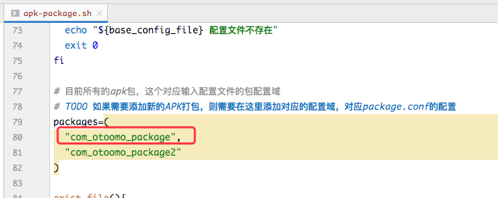
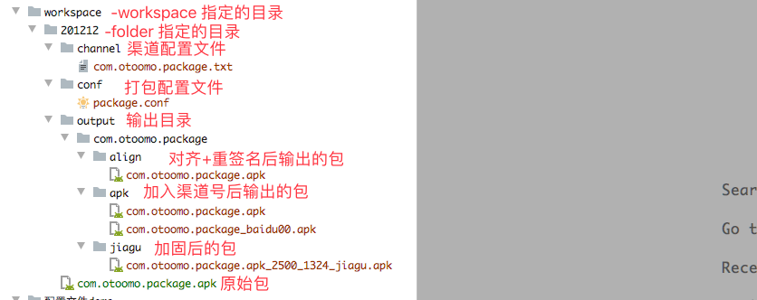

# auto-package

360加固+美团walle 使用shell脚本实现多马甲多渠道自动打包

360加固，安卓重新签名需要JDK8以上


#目录说明

- 配置文件demo            配置文件demo
- resouces                      资源目录
	- channel                渠道配置文件demo，实际使用需要到-folder目录的channel文件夹下添加配置文件
	- config                    基础配置文件分为local本地配置，prod生产配置。不同环境使用不同目录下的base.conf
	- package.jks          APP证书
- tools
	- android-tools       安卓对齐，重签名工具目录
	- jiagu-tools            360加固工具目录
	- walle-cli-all.jsr      美团渠道包打入工具
- apk-package.sh          执行脚本

# package.conf说明

```bash
#[com_otoomo_package] 配置区域开始标识，对应apk-package.sh的 packages
[com_otoomo_package]
#是否开启打包,0:关闭,1:开启
enable=1
#包名，在输出最终文件时使用：${package}_${channel}.apk
package=com.otoomo.package
#原始未加固未写入渠道号的apk
source_apk=com.otoomo.package.apk
#apk对应需要写入的渠道号配置文件名称
channel_file=com.otoomo.package.txt

#[com_otoomo_package2] 配置区域开始标识，对应apk-package.sh的 packages
[com_otoomo_package2]
#是否开启打包,0:关闭,1:开启
enable=1
#包名，在输出最终文件时使用：${package}_${channel}.apk
package=com.otoomo.package2
#原始未加固未写入渠道号的apk
source_apk=com.otoomo.package2.apk
#apk对应需要写入的渠道号配置文件名称
channel_file=com.otoomo.package2.txt
```


**[com_otoomo_package]** 在auto-package.sh中对应的截图示意:




**packages 对应需要打包的apk唯一标识。需要在package.conf体现出来。**


# 渠道号配置文件说明：

如：com.otoomo.package.txt

```txt
#渠道号配置
#最后打包出来的apk名为：com.otoomo.package_baidu00.apk
#apk安装后，使用walle识别到的渠道号为：BAIDU00
baidu00 BAIDU00
baidu01 BAIDU01
```


**对应apk的渠道号配置文件需要在package.conf中配置**


# 脚本使用

命令说明：

```shell script
./apk-package.sh \
    -workspace [工作空间根目录] \
    -folder [工作空间下的工作目录] \
    -baseConfig [基础信息配置文件路径] \
    -type [jiagu|sign|jiagu_sign|package|ready|publish]
```

示例：

```shell script
./apk-package.sh \
    -workspace /Users/modongning/Desktop/local \
    -folder test \
    -baseConfig /Users/modongning/soouya/workspace/auto-package-sh/resources/config/local/base.conf \
    -type jiagu
```

#指令说明

- -workspace     工作空间根目录，存在所有需要打包的文件夹
- -folder        工作空间下的工作目录，所有执行文件都在这个目录下
- -baseConfig    基础信息配置文件，包括了360加固账户密码，签名证书账户和密码等，具体查看base.conf文件备注
- -type          执行类型：jiagu|sign|jiagu_sign|package|ready|publish

#folder目录结构说明



如：

工作空间（-workspace）: /Users/modongning/Desktop/workspace

工作目录(-folder): 201212
    
则 test 目录下的文件结构：

- channel       渠道配置目录，该目录下配置了对应的APP需要打包的渠道号(配置文件demo查看：/配置文件demo/渠道号配置文件demo/com.otoomo.package.txt)
	- com.otoomo.package.txt
- conf             渠道打包配置目录，该目录下固定存放名为 package.conf 的文件，里面配置了每个app打包的信息（配置文件demo查看：/配置文件demo/apk打包配置文件demo/package.conf）
	- package.conf
- output         打包输出目录
	- jiagu     加固后的app输出目录
	- align     排序后的app输出目录
	- apk       重签名后的app输出目录,后面写入渠道也是读取这个目录下的apk文件
- ready_publish 存放预发布的所有apk目录，执行 -type ready 后的apk都会移动到这个目录
